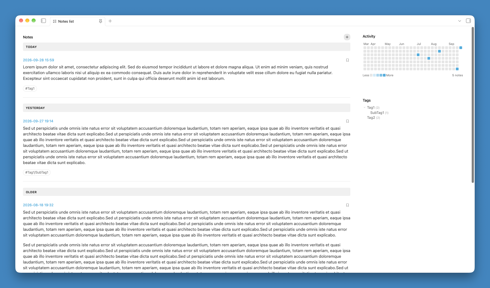

# Notes List

Notes List turns a vault folder into a browsable timeline: a chronological list of its notes on one side, and a GitHub-style activity heatmap and tag browser on the other. It's a good fit for a daily journal, a work log, or any "one note per entry" habit, where seeing *when* things happened matters as much as the notes themselves.

[Official Plugin Page](https://community.obsidian.md/plugins/notes-list) - [Changelog](./CHANGELOG.md)



## Features

Open the view from the ribbon icon ("Open notes list") or the **Notes List: Open** command.

- **Chronological list** — every note in a folder you choose (optionally including its subfolders), newest first. Each entry shows its date and time, an optional file name, and its content — full or a preview, your choice. A preview never cuts a code block or a table in half: it extends to the end of that block instead.
- **Date from frontmatter** — a note's date and time come from its own property named `timestamp` (set it via Obsidian's own "Date & time" property type in the Properties panel), falling back to the file's last-modified time if it isn't set. Click the date, or double-click the note's file name or content, to open the note.
- **Pin notes** — click the bookmark icon on a note to keep it pinned to the top of the list, ahead of everything else matching the current filter. The pin is stored as a `pinned` property in the note's own frontmatter, so it's visible in the note itself and travels with it across a rename or move.
- **Date group headers** (optional) — "Today" / "Yesterday" / "This week" / "Older" labels above the list, so it's obvious at a glance when notes were written.
- **Activity heatmap** — a GitHub-contributions-style grid of the last 6 months, shaded by how many notes were created each day. Click a day or a month label to filter the list down to it. A month that only covers the first (or last) week column is labeled with just its initial, like "S.", so labels never overlap; hover any label for the full month name.
- **Tag browser** — a collapsible tree of every tag found in the notes in scope, each with a count of matching notes. Click a tag to filter the list to it (including its nested sub-tags, e.g. `#area/work` under `#area`). An *Untagged* entry, always at the end of the list, shows the notes that have no tags at all.
- **Full-text search** — a search box at the top of the sidebar finds notes containing every word you type (anywhere in the note's text or file name, case-insensitive). The search runs when you click **Search** or press Enter, not while you type, and is near-instant even in folders with thousands of notes: note text is indexed in the background as soon as the view opens. Press **/** or **Cmd+F** (**Ctrl+F** on Windows/Linux) while the view is focused to jump to the search box, or use the **Search notes** command (assign it your own shortcut from Settings → Hotkeys) to open the view straight into it.
- **Combine filters** — the search, tag, day and month filters can all be active together, each with its own pill (and `x`) below the heatmap to clear just that one.
- **Pagination** — long lists are split into pages, so browsing stays fast no matter how many notes are in the folder.
- **New Note button** — creates a new, uniquely-named note directly in the watched folder in one click, with today's date already set. No other plugin required; optionally starts from a template note of your choice (see Settings below). Also available as the **Create new note** command, so you can assign it your own keyboard shortcut from Settings → Hotkeys — it works even when the Notes List view isn't open.
- **Works on mobile** — on a phone, or in any pane narrower than 720 px, the view stacks into a single column: search, heatmap, a collapsible Tags section, then the notes. The search button shows just a magnifier icon, with the New Note button right next to it.
- Respects Obsidian's own "Readable line length" setting, and refreshes automatically as notes in the folder are created, edited, deleted, renamed, or have their frontmatter changed.

## Installation

Notes List is available in the official Obsidian Community Plugins directory: [community.obsidian.md/plugins/notes-list](https://community.obsidian.md/plugins/notes-list).

To install it from Obsidian:

1. Open **Settings → Community plugins** and turn off Restricted mode if it's on.
2. Click **Browse**, search for "Notes List", then click **Install** and **Enable**.

### Building from source

To build it yourself instead:

```bash
npm install
npm run build
```

Then copy `manifest.json`, `main.js` and `styles.css` into `<your-vault>/.obsidian/plugins/notes-list/`, and enable the plugin from Settings → Community plugins.

For local development, `npm run deploy` builds and copies those three files straight into a vault in one step (see `copy-to-vault.mjs`; defaults to a path set for local testing, override with `OBSIDIAN_VAULT_PATH`).

## Settings

Requires Obsidian **1.13.0** or later. The settings tab groups related controls under a shared heading, and every setting can be found through Obsidian's settings search:

| Group | Setting | Description |
| --- | --- | --- |
| Folder and files | Folder | Vault folder to watch, empty = entire vault. |
| Folder and files | Subfolders | Also show notes from subfolders of the chosen folder. |
| Folder and files | Template | Optional note to start new notes from (empty = a blank note); the template must have a property named `timestamp` in its frontmatter. |
| Folder and files | Unique note name format | moment.js format for the New Note button's auto-generated file name (default `YYYYMMDDHHmmss`); also what "When different from unique note name" compares against. |
| Notes list | Show note name | *Never* / *Always* / *When different from unique note name* (default; see [Features](#features) above). |
| Notes list | Content display | *Full* / *Preview* (default); a note can override this with its own `content-display` frontmatter property. |
| Notes list | Preview length | Max characters shown when Content display (or a note's own override) is *Preview* (default 300); the field stays enabled either way. |
| Notes list | Show date group headers | Show "Today" / "Yesterday" / "This week" / "Older" headers above the list (default off). |
| Notes list | Notes per page | Number of notes shown per page in the list (default 10). |
| Sidebar | Tag tree expansion | How far the tag tree is expanded by default: *Fully collapsed* / *Expand to level 2* / *Expand to level 3* / *Fully expanded* (default). You can still expand or collapse any tag by hand; changing this setting resets those manual changes. |

**Desktop and mobile.** The *Notes list* and *Sidebar* settings have two independent values: one for the desktop app and one for the Obsidian mobile app (phone and tablet). The settings tab shows each setting once, and changing it only affects the kind of device you're on, as a note at the top of the *Notes list* group reminds you. So to change the mobile values, open the settings from your phone or tablet. Both sets are saved in the plugin's settings file and synced with your vault, so changing one never overwrites the other. When upgrading from a version without this split, your existing values are copied to both sets.

## Customizing font sizes

The size of the notes' text can be changed with a [CSS snippet](https://help.obsidian.md/snippets), separately for the regular layout and for the single-column (mobile) one:

| Variable | Affects | Default | Default in single column |
| --- | --- | --- | --- |
| `--notes-list-content-font-size` | Note content | Inherited from Obsidian | `1.1rem` |
| `--notes-list-content-line-height` | Line height of the note content's paragraphs | `1.4rem` | `1.4rem` |
| `--notes-list-title-font-size` | Note file name | Inherited from Obsidian | 1.1 × inherited (`1.1em`) |
| `--notes-list-date-font-size` | Date and time link | Obsidian's small UI font size | Obsidian's small UI font size |
| `--notes-list-panel-title-font-size` | Section titles ("Notes", "Activity", "Tags") | Obsidian's level-4 heading size | `1.1rem` |

Each one has a `--notes-list-mobile-…` counterpart (for example `--notes-list-mobile-content-font-size`) that applies only in the single-column layout. In that layout the mobile variable wins if set, then the regular one, then the single-column default above.

```css
body {
	--notes-list-content-font-size: 15px;
	--notes-list-mobile-content-font-size: 17px;
	--notes-list-mobile-content-line-height: 1.6;
	--notes-list-mobile-date-font-size: 14px;
}
```

## Changelog

See [CHANGELOG.md](./CHANGELOG.md).

## Development

See [CLAUDE.md](./CLAUDE.md) for build commands and an architecture overview.

## License

[MIT](./LICENSE)
